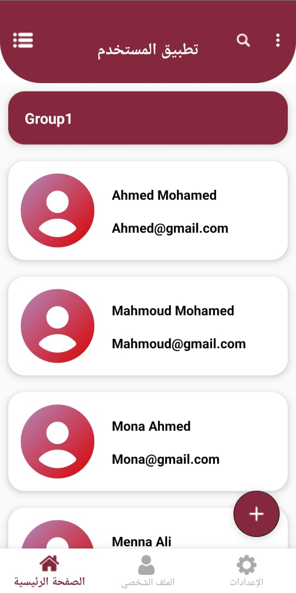

# Android Student Groups App 📚

An interactive Android app built using Kotlin, designed to display and manage a categorized list of users (e.g., students grouped by sections).  
The app leverages modern UI components including Toolbar, Navigation Drawer, Bottom Navigation, and RecyclerView, and includes support for dynamic language switching (English ↔ Arabic).

---

## ✨ Features

- 👥 Grouped user list with names and emails using `RecyclerView`
- 🧭 Navigation Drawer with clickable menu items
- 🧩 Bottom Navigation for quick access to sections
- 🔍 Toolbar with menu icons (search, profile, settings, change language)
- 🌐 Switch app language dynamically (e.g., English ↔ Arabic)
- 💡 Material Design components and clean UI structure
- 🧼 Well-structured code with data binding

---

## 📸 Screenshots

| Home Screen (English) | Home Screen (Arabic) | Navigation Drawer | Language Switching |
|-----------------------|----------------------|-------------------|--------------------|
|  |  |  |  |  |  |

> 💡 Place your screenshots inside `assets/screenshots/` folder

---

## ⚙️ Installation

To run the project locally:

1. **Clone the Repository**

```bash
git clone https://github.com/your-username/student-groups-app.git
